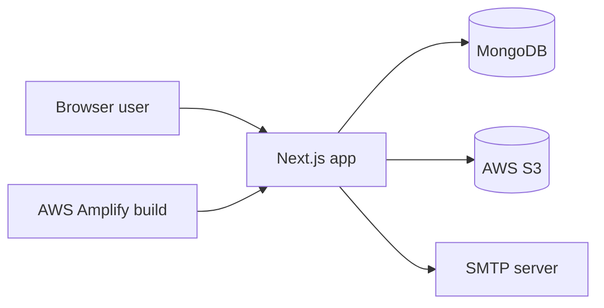
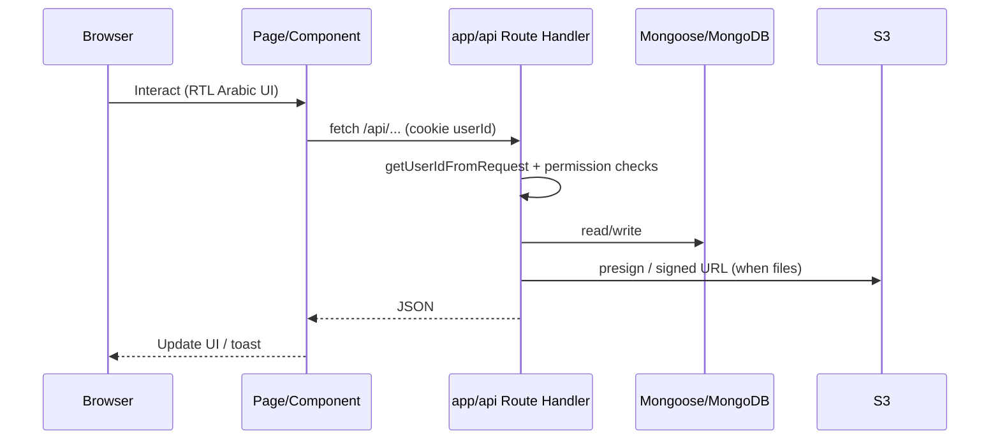
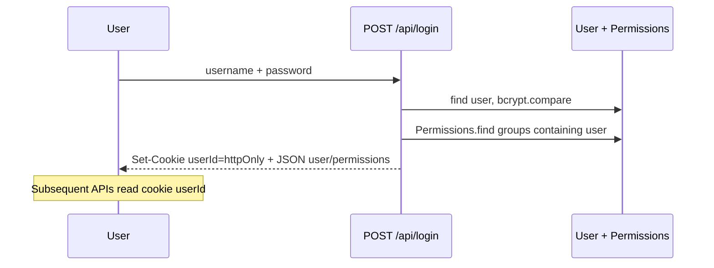
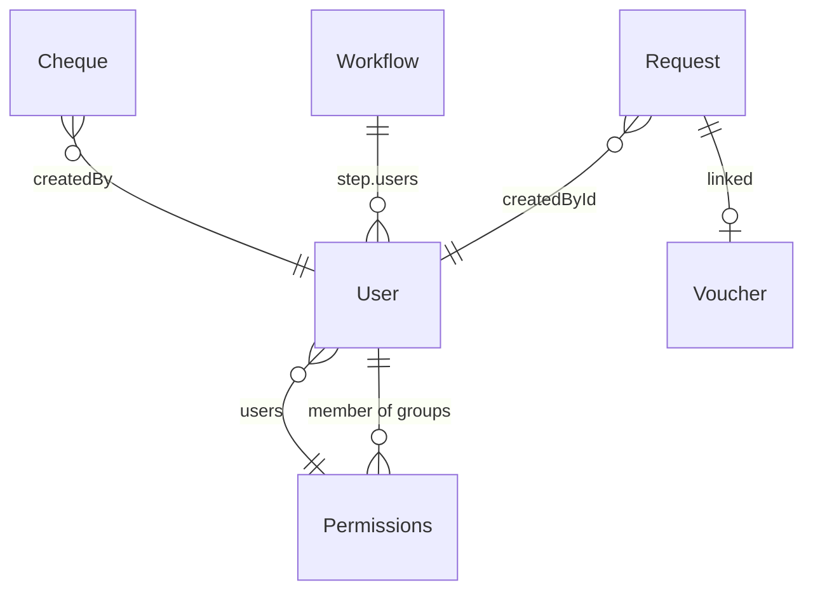
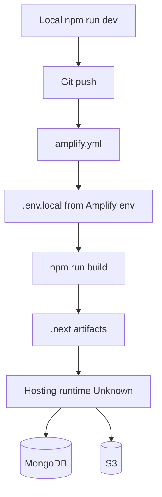

# PROJECT_HANDBOOK.md — Fund Request (SPC)

> **Evidence-based technical handbook** for the `new-fund-req` repository.  
> Generated by reverse-engineering first-party source code. Existing docs (`README.md`, `docs/ACTIONS.md`) were verified against the implementation and treated as secondary.

---

## Table of Contents

1. [Document Information](#1-document-information)
2. [Executive Summary](#2-executive-summary)
3. [Quick Start](#3-quick-start)
4. [Technology Stack](#4-technology-stack)
5. [High-Level Architecture](#5-high-level-architecture)
6. [Repository Structure](#6-repository-structure)
7. [Application Entry Points and Runtime Lifecycle](#7-application-entry-points-and-runtime-lifecycle)
8. [Feature and Module Inventory](#8-feature-and-module-inventory)
9. [Routing and Navigation](#9-routing-and-navigation)
10. [UI and UX Architecture](#10-ui-and-ux-architecture)
11. [State Management and Data Flow](#11-state-management-and-data-flow)
12. [Backend Architecture](#12-backend-architecture)
13. [API Reference](#13-api-reference)
14. [Database and Persistence Layer](#14-database-and-persistence-layer)
15. [Authentication, Authorization, and Security](#15-authentication-authorization-and-security)
16. [Configuration and Environment Variables](#16-configuration-and-environment-variables)
17. [External Integrations](#17-external-integrations)
18. [Background Jobs and Scheduled Tasks](#18-background-jobs-and-scheduled-tasks)
19. [Error Handling, Logging, and Observability](#19-error-handling-logging-and-observability)
20. [Testing and Quality Assurance](#20-testing-and-quality-assurance)
21. [Build, Deployment, and Operations](#21-build-deployment-and-operations)
22. [Coding Conventions and Architecture Rules](#22-coding-conventions-and-architecture-rules)
23. [Safe Modification Guide](#23-safe-modification-guide)
24. [Critical Business Rules](#24-critical-business-rules)
25. [Known Issues, Risks, and Technical Debt](#25-known-issues-risks-and-technical-debt)
26. [Rebuild Blueprint](#26-rebuild-blueprint)
27. [Troubleshooting Guide](#27-troubleshooting-guide)
28. [Important File Index](#28-important-file-index)
29. [Unknowns and Questions for Maintainers](#29-unknowns-and-questions-for-maintainers)
30. [Glossary](#30-glossary)

---

## 1. Document Information

| Field | Value |
| ----- | ----- |
| Project name | `new-fund-req` (UI metadata: **Fund Request** / **SPC Dashboard**) |
| Repository type | Single Next.js App Router application (not a monorepo) |
| Documentation generation date | 2026-09-26 |
| Git branch (at analysis) | `main` |
| Commit hash (at analysis) | `b23c0459742c2593501689837108decdce594f4b` |
| Repository state | Working tree had **uncommitted** voucher Excel template/export changes and untracked Arabic Excel form files (see §1.1) |
| Applications covered | One web app: fund-request dashboard + APIs under `app/` |
| Packages / services covered | N/A — no workspace packages; Node route handlers only |
| Scope limitations | Did not reverse-engineer `node_modules`, `.next`, or binary PDFs/DOCX in `docs/` beyond noting they exist. Did not connect to live MongoDB/S3. Did not run `npm run build` (slow / may need full env). Lint/tests: no test suite present. |
| Related secondary docs | `README.md` (boilerplate), `docs/ACTIONS.md` (Arabic operational map — largely accurate), `PROMPT_EXCEPTIONS_SYSTEM.md`, `PROMPT_تصميم_التقرير_اليومي.md` |

### 1.1 Uncommitted / untracked at analysis time (**Confirmed**)

| Path | Status |
| ---- | ------ |
| `app/api/vouchers/reports/export/route.js` | Modified |
| `lib/voucher/buildDailyCashReportExcel.js` | Modified |
| `lib/voucher/templates/voucher-daily-form.xlsx` | Modified |
| `public/templates/voucher-daily-form.xlsx` | Modified |
| `فورمة_صندوق_فارغة_excel.xlsx` | Untracked |
| Unicode-named `فورمة_صندوق_فارغة.xlsx` | Untracked |

### Evidence labels used in this handbook

| Label | Meaning |
| ----- | ------- |
| **Confirmed** | Directly verified in source or config |
| **Inferred** | Strongly implied by implementation, not explicitly documented |
| **Unknown** | Cannot be determined from the repository alone |
| **Not applicable** | Concept does not apply to this project |
| **Recommended** | Rebuild/architecture advice — not describing current code |

---

## 2. Executive Summary

### What the project does (**Confirmed**)

Internal **SPC** (Solution Portal Company / related group companies) web application for:

1. **Fund requests** (طلبات التمويل) per company — create, approve via multi-step workflow, attach files, cancel/reject.
2. **Payment / receipt vouchers** (وصولات صرف وقبض) — A5 printable canvases, sequences, person identity attachments, daily cash Excel reports.
3. **Disbursement tracking** — whether approved requests have a linked voucher.
4. **EX booking forms** (طلبات الحجز) — replace booking, waiver, cancel unit, unit transfer, attachment-only, payment-plan “exceptions”.
5. **Cheques** (صكوك) — bank templates, branch selection, print calibration, print history.
6. **Admin** — permission groups, workflow templates, transfer ownership, voucher↔request linking, bulk workflow edits.

### Likely users (**Confirmed** via permissions & UI Arabic)

Staff of Al-Ghadeer / Badur / Tiba / related funds: requesters, approvers, cashiers (وصولات), cheque operators, EX booking clerks, and admins with `MANAGE_PERMISSIONS`.

### Business purpose (**Confirmed**)

Digitize and control cash/fund disbursement and related real-estate booking exception paperwork for multiple company keys, with S3-stored attachments and printable Arabic documents.

### Major modules (**Confirmed**)

| Module | Arabic | Entry |
| ------ | ------ | ----- |
| Auth | تسجيل الدخول | `/login` |
| Home / company cards | الرئيسية | `/home` |
| Fund requests | طلبات … | `/requests/[company]` |
| Workflows | الموافقات | `/workflow` |
| Permissions / users | إدارة الصلاحيات / إنشاء يوزر | `/permissions`, `/register` |
| Vouchers | وصل صرف وقبض | `/vouchers` |
| Voucher reports | تقارير الوصولات | `/vouchers/reports` |
| Disbursement track | تتبع صرف الطلبات | `/receipts/disbursement` |
| Reports | تقارير | `/reports`, `/reports/ex` |
| Cheques | نظام الصكوك | `/cheques` |
| EX booking | طلبات الحجز | `/ex/ex-home` |
| Admin tools | وورك فلو الطلبات، نقل، ربط وصولات | `/admin/*` |

### Overall architecture (**Confirmed**)

- **Next.js 15** App Router, React 19, single deployable with `output: "standalone"`.
- **Route Handlers** under `app/api/**` (no separate backend service).
- **MongoDB** via Mongoose (`MONGODB_URI`).
- **Auth**: httpOnly cookie `userId` (Mongo `_id`); permissions from `Permissions` groups.
- **Files**: AWS S3 presigned upload/download.
- **Email**: Nodemailer / SMTP for workflow notify.
- **UI**: Tailwind CSS v4 + Framer Motion; Arabic RTL per-page (not global `dir=rtl`).

### External systems (**Confirmed**)

MongoDB, AWS S3, SMTP mail, optional cookie domain `.spc-it.com.iq`, AWS Amplify build (`amplify.yml`).

### Maturity (**Inferred**)

Production-oriented feature set (Amplify config, standalone output, multi-company ops) with uneven security hardening, almost no automated tests, and some disabled legacy endpoints.

### Top technical risks (**Confirmed**)

1. Several API routes lack authentication (see §15 / §25).
2. `next.config.mjs` `env` block injects server secrets (including `MONGODB_URI`, S3, SMTP) into the Next client bundle surface.
3. Session cookie lasts **one year**; no Next.js middleware route protection.
4. Daily Excel export is sensitive to OOXML quirks (Numbers vs Microsoft Excel) — see voucher Excel libs.

---

## 3. Quick Start

### Required software (**Confirmed**)

| Tool | Notes |
| ---- | ----- |
| Node.js | Repo has no `engines` field. Audit machine had Node **v24.15.0**; Next 15.5 typically expects Node 18.18+ / 20+. **Unknown** which version production uses. |
| npm | Lockfile is `package-lock.json` (npm). Audit: npm **11.12.1**. |
| MongoDB | Reachable URI in env |
| AWS S3 bucket | For attachments |
| SMTP (optional) | Workflow email notify |

### Package manager (**Confirmed**)

`npm` — scripts in `package.json`.

### Install dependencies

```bash
npm install
```

Source: `package.json` / `amplify.yml` preBuild.

### Environment setup

Create `.env.local` (or `.env`; both gitignored via `.env*`) with at least:

```bash
MONGODB_URI=<REDACTED>
S3_ACCESS_KEY_ID=<REDACTED>
S3_SECRET_ACCESS_KEY=<REDACTED>
S3_REGION=<REDACTED>
S3_BUCKET_NAME=<REDACTED>
SMTP_HOST=<REDACTED>
SMTP_PORT=<REDACTED>
SMTP_USER=<REDACTED>
SMTP_PASS=<REDACTED>
MAIL_FROM=<REDACTED>
```

`lib/mongodb.js` **throws at import** if `MONGODB_URI` is missing.

Optional / script-only vars: `EX_BASE_DOMAIN`, `SMTP_FROM`, `SOURCE_MONGODB_URI`, `TARGET_MONGODB_URI`, `OLD_MONGODB_URI`, `NEW_MONGODB_URI`, `GUIDE_SCREENSHOT_URL` (see §16).

### Local development

```bash
npm run dev
```

Runs `next dev --turbopack` → typically [http://localhost:3000](http://localhost:3000). Root `/` redirects to `/login`.

### Production build / start

```bash
npm run build    # next build (standalone output)
npm run start    # next start
```

### Linting

```bash
npm run lint     # eslint (eslint.config.mjs + eslint-config-next)
```

### Type checking

**Not applicable** — project is JavaScript (`jsconfig.json` path alias only; no `tsc` script).

### Testing

**Not applicable** — no `*.test.*` / `*.spec.*` / `__tests__` found outside `node_modules`.

### Database preparation

No migration runner in normal app flow. `app/api/migrate` is **hard-disabled (403)**. Ad-hoc scripts: `migrate.mjs`, `bat.js`, `bat2.js`, `bat3.js`, `scripts/repair-wrong-voucher-steps.mjs` — treat as ops tools; do not run against production without review.

### Common startup problems

| Symptom | Cause | Fix |
| ------- | ----- | --- |
| `Please define MONGODB_URI` | Missing env | Set `MONGODB_URI` in `.env.local` |
| Login fails | User/hash mismatch or DB | Check `users` collection; passwords are bcrypt |
| Uploads fail | Missing S3 env | Set `S3_*` vars |
| Excel export missing template | Standalone tracing | Ensure `lib/voucher/templates/voucher-daily-form.xlsx` exists; see `next.config.mjs` `outputFileTracingIncludes` |

---

## 4. Technology Stack

Versions from `package.json` range + `package-lock.json` resolved versions (**Confirmed**).

| Layer | Technology | Version | Purpose | Evidence |
| ----- | ---------- | ------: | ------- | -------- |
| Language | JavaScript (JSX) | — | App source | `app/`, `components/`, `lib/` |
| Runtime | Node.js | Unknown in prod | Server | Route handlers `runtime = "nodejs"` on login |
| Framework | Next.js App Router | 15.5.2 | SSR/CSR pages + API | `package-lock.json`, `app/` |
| UI library | React / React DOM | 19.1.0 | Components | `package.json` |
| Styling | Tailwind CSS | 4.1.13 | Utility CSS | `app/globals.css`, `@tailwindcss/postcss` |
| PostCSS | `@tailwindcss/postcss` | 4.1.13 | Tailwind pipeline | `postcss.config.mjs` |
| Animation | Framer Motion | 12.23.12 | UI motion | Home, modals |
| Icons | react-icons | 5.5.0 | Icon set | `app/home/page.js` |
| Selects | react-select | 5.10.2 | Dropdowns | Dependencies |
| HTTP client | axios | 1.13.2 | Outbound HTTP | Dependency (usage varies) |
| DB ODM | mongoose | 8.19.0 | MongoDB | `lib/mongodb.js`, `models/` |
| Auth crypto | bcryptjs | 3.0.2 | Password verify/hash | `app/api/login/route.js` |
| Object storage | `@aws-sdk/client-s3`, presigner | 3.901.0 | S3 upload/download | `lib/s3/` |
| Email | nodemailer | 7.0.13 | SMTP | `lib/mailer.js`, workflow notify |
| Excel | exceljs, xlsx | 4.4.0 / 0.18.5 | Reports/export | `lib/voucher/buildDailyCashReportExcel.js` |
| PDF | jspdf, pdf-lib, html2canvas, html-to-image | various | Print/PDF | Cheques / requests |
| Multipart | formidable | 3.5.4 | Form parsing | Dependency |
| Lint | eslint + eslint-config-next | 9.x / 15.5.2 | Lint | `npm run lint` |
| Image (dev) | sharp, puppeteer, image-size | various | Guide/screenshot scripts | `scripts/`, `devDependencies` |
| Docs gen (dev) | docx, html-to-docx | various | Fund guide generation | `scripts/generate-fund-guide-*.mjs` |
| Deploy config | AWS Amplify | — | CI build | `amplify.yml` |
| Package manager | npm | lockfile | Install | `package-lock.json` |

---

## 5. High-Level Architecture

### System context (**Confirmed**)



### Frontend → backend → data (**Confirmed**)



### Authentication flow (**Confirmed**)



### Deployment topology (**Confirmed** config / **Inferred** hosting)

- **Confirmed**: `amplify.yml` builds with npm, writes secrets into `.env.local` at build, `npm run build`, artifacts `.next`.
- **Confirmed**: `next.config.mjs` sets `output: "standalone"` (typical for container/Node host).
- **Inferred**: Runtime may be Amplify Hosting SSR or a Node host consuming standalone output — exact production process manager **Unknown**.

---

## 6. Repository Structure

### Annotated top-level (**Confirmed**)

| Path | Responsibility | Kind |
| ---- | -------------- | ---- |
| `app/` | Pages, layouts, API route handlers | Application |
| `components/` | Shared & feature UI | Application |
| `context/` | User + Permission React contexts | Application |
| `hooks/` | Client hooks (`usePermission`, voucher suggest) | Application |
| `lib/` | Domain logic (auth, permissions, vouchers, cheques, EX, S3, email) | Application |
| `models/` | Mongoose schemas | Application |
| `public/` | Static assets (logos, voucher/cheque images, Excel templates) | Assets |
| `docs/` | Arabic/English guides, ACTIONS map, PDFs | Documentation |
| `scripts/` | One-off generators, repairs, screenshots | Ops scripts |
| `bat.js`, `bat2.js`, `bat3.js`, `migrate.mjs` | Migration / batch utilities | Ops scripts |
| `amplify.yml` | Amplify CI | Deployment |
| `next.config.mjs` | Next config + env injection + tracing includes | Configuration |
| `package.json` / `package-lock.json` | Dependencies & scripts | Configuration |
| `eslint.config.mjs`, `postcss.config.mjs`, `jsconfig.json` | Tooling | Configuration |
| `.env` / `.env*` | Secrets (gitignored) | Secrets — do not commit |
| `.next/`, `node_modules/` | Generated / vendor | Ignore for deep analysis |
| Root `*.xlsx` | Report templates / working forms | Assets / WIP |

### Important nested dirs

| Path | Notes |
| ---- | ----- |
| `app/api/` | All HTTP APIs |
| `lib/voucher/` | Voucher business logic + Excel daily form |
| `lib/cheques/` | Cheque print/layout/PDF |
| `lib/exForms/` | EX form registry + definitions |
| `lib/s3/` | S3 env, browser upload helpers, attachment access |
| `lib/receipts/` | Disbursement report pipelines |
| `lib/admin/` | Transfer permissions/requests helpers |
| `components/cheques/`, `components/ex/` | Feature UIs |
| `public/templates/` | `voucher-daily-form.xlsx` for export |
| `lib/voucher/templates/` | Same template for server-side export + logos |

### Monorepo

**Not applicable** — single app; no workspaces in `package.json`.

---

## 7. Application Entry Points and Runtime Lifecycle

| Concern | Location | Behavior |
| ------- | -------- | -------- |
| Root page | `app/page.js` | Redirect to `/login` |
| Root layout | `app/layout.js` | Fonts, gradient background, providers, Header, `<main>` |
| Global CSS | `app/globals.css` | Tailwind import, CSS vars, body Arial, shimmer |
| Providers | Toast → User → Permission → AuthGate | Nested in layout |
| Auth gate | `components/AuthGate.jsx` | Non-login routes: if loaded and no user → `/login` |
| Header | `components/Header.jsx` | Hidden on login; permission-gated Arabic menu |
| Middleware | — | **None** (`middleware.js` not present) |
| API bootstrap | Per-route `dbConnect()` | Cached mongoose connection in `lib/mongodb.js` |
| Client hydration | `"use client"` pages | Most interactive pages are client components |
| Shutdown | — | **Not applicable** — no custom shutdown hooks |

### Startup until first useful screen (**Confirmed**)

1. Next serves `app/layout.js`.
2. User hits `/` → `/login`.
3. Login `POST /api/login` sets `userId` cookie.
4. Client navigates `/home`; `PermissionProvider` calls `/api/user-permissions` (polls every 5s).
5. Home renders company/tool cards filtered by `companies` + `permissions`.

---

## 8. Feature and Module Inventory

| Module | Purpose | User Entry Point | Main UI Files | Backend Files | Data Sources | Permissions | Status |
| ------ | ------- | ---------------- | ------------- | ------------- | ------------ | ----------- | ------ |
| Auth | Login/logout/session | `/login` | `app/login/page.jsx` | `app/api/login`, `logout`, `auth/me`, `userid` | `users`, cookie | Public login | Active |
| Home | Company & tool dashboard | `/home` | `app/home/page.js` | `notifications/counts`, `company-actions` | counts APIs | Companies list + perms | Active |
| Fund requests | Create/approve fund requests | `/requests/[company]` | `RequestsPage`, `RequestDetails`, `CreateRequestModal` | `app/api/requests/**` | `requests_{company}` | CREATE/EDIT/DELETE/APPROVE/… | Active |
| Workflows | Approval templates | `/workflow` | `app/workflow/*` | `app/api/workflow/**` | `workflows` | `MANAGE_PERMISSIONS` | Active |
| Permissions | Groups | `/permissions` | `app/permissions/*` | `app/api/permissions/**`, `users` | `permissions`, `users` | `MANAGE_PERMISSIONS` | Active |
| Users | Register/manage | `/register` | `app/register/page.jsx` | `app/api/users` | `users` | `MANAGE_PERMISSIONS` | Active |
| Vouchers | Print payment/receipt | `/vouchers`, `/vouchers/view` | `Voucher*` components | `app/api/vouchers/**` | `vouchers`, counters | `RECEIPTS`, company voucher keys | Active |
| Voucher reports | Filter + Excel export | `/vouchers/reports` | `app/vouchers/reports/page.jsx` | `vouchers/reports`, `export` | vouchers + Excel template | `VOUCHERS_REPORTS_VIEW` / `RECEIPTS` | Active |
| Disbursement | Track paid requests | `/receipts/disbursement` | page | `receipts/disbursement-report` | requests + vouchers | `RECEIPTS` | Active |
| Reports | Fund request aggregates | `/reports` | page | `app/api/reports` | requests | `VIEW_REPORTS` / `VIEW_ALL_REPORTS` | Active |
| EX booking | Booking exception forms | `/ex/*` | `app/ex/**`, `components/ex/**` | `app/api/ex/**` | EX models | `EX`, form-specific, `EX_WORKFLOW` | Active |
| EX reports | EX aggregates | `/reports/ex` | page | `app/api/reports/ex` | EX collections | `EX_REPORTS` / reports | Active |
| Cheques | Issue/print cheques | `/cheques/**` | `components/cheques/**` | `app/api/cheques/**` | cheque models | `CHEQUES`, layout editor | Active |
| Admin workflow | Bulk/edit request workflows | `/admin/requests-workflow` | pages | `admin/requests-workflow/**` | requests | `MANAGE_PERMISSIONS` | Active |
| Admin transfer | Move requests/perms | `/admin/transfer-requests` | page | `admin/transfer-*` | users/groups/requests | `MANAGE_PERMISSIONS` | Active |
| Admin voucher links | Link voucher↔request | `/admin/voucher-links` | page | `admin/voucher-links` | vouchers/requests | `MANAGE_PERMISSIONS` | Active |
| Files | Upload/download | In-request/modals | S3 helpers | `upload/*`, `files/*`, `download` | S3 | Cookie (mostly) | Active |
| Notifications | Home badges | Home | Header/home | `notifications/counts` | requests | Scoped by perms | Active |
| Delete-all | Dangerous wipe UI | `/requests/deleteAll` | page | (uses requests APIs) | requests | **High risk UI** | Present |
| Disabled stubs | migrate/test/smtp/disable-user | — | — | respective routes | — | Always 403 | Disabled |

---

## 9. Routing and Navigation

### Frontend routes (**Confirmed**)

| Route | Page/Layout | Purpose | Access Control | Important Parameters |
| ----- | ----------- | ------- | -------------- | -------------------- |
| `/` | `app/page.js` | Redirect login | Public | — |
| `/login` | `app/login/page.jsx` | Sign-in | Public | — |
| `/home` | `app/home/page.js` | Dashboard | AuthGate + companies/perms | — |
| `/register` | `app/register/page.jsx` | Users | `MANAGE_PERMISSIONS` | — |
| `/workflow` | `app/workflow/page.js` | Workflow list | `MANAGE_PERMISSIONS` | — |
| `/workflow/[id]` | `app/workflow/[id]/page.js` | Edit workflow | `MANAGE_PERMISSIONS` | `id` |
| `/permissions` | `app/permissions/page.js` | Groups | `MANAGE_PERMISSIONS` | — |
| `/permissions/[id]` | `app/permissions/[id]/page.js` | Group detail | `MANAGE_PERMISSIONS` | `id` |
| `/requests/[company]` | list | Company requests | Company access | `company` |
| `/requests/[company]/new` | duplicate flow | Clone | `DUPLICATE_REQUEST` | `company` |
| `/requests/[company]/[id]` | detail | One request | Company access | `company`, `id` |
| `/requests/deleteAll` | wipe UI | Delete all | Admin-ish (verify before use) | — |
| `/admin/requests-workflow` | admin list | Bulk workflow | `MANAGE_PERMISSIONS` | — |
| `/admin/requests-workflow/[id]` | admin detail | Edit one | manage + company | `id` |
| `/admin/transfer-requests` | transfer | Ownership transfer | manage | — |
| `/admin/voucher-links` | link UI | Voucher links | manage | — |
| `/vouchers` | create/print | Vouchers | `RECEIPTS` / voucher keys | query company/mode |
| `/vouchers/view` | view/edit | One voucher | receipts/reports | `?id=` |
| `/vouchers/reports` | reports | Filters/export | reports/receipts | filters |
| `/receipts/disbursement` | track | Disbursement | `RECEIPTS` | filters |
| `/reports` | reports | Fund reports | `VIEW_REPORTS` | — |
| `/reports/ex` | EX reports | Booking reports | EX reports perms | — |
| `/cheques` | home | Templates | `CHEQUES` | — |
| `/cheques/[templateKey]` | editor | Create cheque | `CHEQUES` | `templateKey` |
| `/cheques/view` | preview | View cheque | `CHEQUES` | `?id=` |
| `/cheques/reports` | reports | Search | `CHEQUES` | — |
| `/cheques/reports/prints` | print log | History | `CHEQUES` | — |
| `/cheques/*/branches` | branches | Branch pickers | `CHEQUES` | template-specific |
| `/ex/ex-home` | EX hub | Companies | `EX` | — |
| `/ex/ex-home/[companyKey]` | forms | Company forms | EX + company | `companyKey` |
| `/ex/[pageKey]` | list | Form list | form permission | `pageKey` |
| `/ex/[pageKey]/[id]` | detail | Form detail | EX | `pageKey`, `id` |
| `/ex/workflow` | EX WF | Templates | `EX_WORKFLOW` | — |
| `/ex/workflow/[id]` | edit | One EX WF | `EX_WORKFLOW` | `id` |
| `/ex/payment-plan` | list | Payment plans | EX exceptions | — |
| `/ex/payment-plan/[id]` | detail | One plan | EX | `id` |
| `/ex/payment-plan/layout` | layout editor | A4 layout | EX create/view | — |

### Navigation (**Confirmed**)

- Primary nav: right slide-out in `components/Header.jsx` (Arabic sections: التنقل، الإدارة، الأنظمة، التقارير).
- Titles: `lib/headerTitle.js`.
- Reports often open in **new tab**.
- Nested layouts: mostly root layout only; EX/cheque pages use page-local structure.
- No global `not-found.js` / `error.js` specialization found in audit (**Unknown** if defaults only).
- Loading: `PageLoader`, inline spinners — no App Router `loading.js` inventory required beyond components.

---

## 10. UI and UX Architecture

### 10.1 Design System (**Confirmed**)

| Token | Value / behavior | Evidence |
| ----- | ---------------- | -------- |
| Background CSS var | `#ffffff` / dark media `#0a0a0a` | `app/globals.css` |
| Foreground CSS var | `#171717` / dark `#ededed` | same |
| Body force | Always white bg + dark text (overrides dark vars) | `body { background: #ffffff }` |
| Layout backdrop | Slate gradient + blue/purple/amber blobs | `app/layout.js` |
| Fonts | Geist vars loaded; body uses Arial/Helvetica; Header uses Poppins for brand | layout + Header |
| Animation | `@keyframes shimmer`; Framer Motion extensively | globals + pages |
| RTL | Per-component `dir="rtl"`; `html lang="en"` | layout vs pages |
| Tailwind | v4 via `@import "tailwindcss"`; **no** `tailwind.config.*` | globals + postcss |
| Icons | `react-icons/fi` etc. | home |
| Spacing / radius | Ad-hoc Tailwind utilities (no formal scale file) | **Inferred** pattern |

### 10.2 Layout (**Confirmed**)

- Shell: fixed decorative background + sticky Header + padded `main`.
- Header: SPC branding, center title, user chip, hamburger → right drawer.
- No persistent left sidebar.
- Modals/drawers: overlay pattern (requests, vouchers, cheques).

### 10.3 Shared components (selected inventory)

| Component | File | Responsibility | Used By |
| --------- | ---- | -------------- | ------- |
| Header | `components/Header.jsx` | Nav + logout | Layout |
| AuthGate | `components/AuthGate.jsx` | Redirect unauthenticated | Layout |
| ToastProvider | `components/ui/ToastProvider.jsx` | Toasts | Layout |
| PageLoader | `components/PageLoader.jsx` | Full-page load | Home, requests |
| LoadingSpinner | `components/LoadingSpinner.jsx` | Compact spinner | Various |
| Pagination / TablePagination | `components/Pagination.jsx`, `TablePagination.jsx` | Paging | Lists |
| StatusBadge | `components/StatusBadge.jsx` | موافق/مرفوض/ملغي/قيد الانتظار | Requests |
| RequestsPage | `components/RequestsPage.jsx` | Company request list | requests routes |
| RequestDetails | `components/RequestDetails.jsx` | Detail + approve | request id page |
| CreateRequestModal | `components/CreateRequestModal.jsx` | Create/edit request | RequestsPage |
| CommentModal | `components/CommentModal.jsx` | Approve/reject comments | RequestDetails |
| PrintableRequestPDF | `components/PrintableRequestPDF.jsx` | Print layout | Requests |
| Voucher* | `components/Voucher*.jsx` | Canvas/print/attach | Vouchers |
| Cheque* | `components/cheques/*` | Cheque UI | Cheques |
| EX payment plan | `components/ex/*` | Plans/layout | EX |
| IdleLogoutGuard | `components/IdleLogoutGuard.jsx` | 30-min idle logout | **Defined but not mounted in layout** |
| NotificationsPanel | `components/NotificationsPanel.jsx` | Stub (empty) | Unused |

### 10.4 Screen inventory (summary)

Major screens are listed in §8–§9. Shared patterns:

- Arabic primary labels; English metadata title “Fund Request”.
- Permission-gated empty states (cards disappear if no access).
- Filters on reports/lists via query params + client state.
- Print-centric voucher/cheque canvases with absolute positioning (%).

### 10.5 Accessibility (**Confirmed** gaps)

| Topic | Finding |
| ----- | ------- |
| Semantic HTML | Mixed; many `div`/`button` patterns |
| Keyboard / focus | Not systematically implemented |
| ARIA | Sparse |
| `lang` | `html lang="en"` despite Arabic UI |
| Reduced motion | No dedicated support found |
| IdleLogoutGuard | Not wired — session may linger in UI |

---

## 11. State Management and Data Flow

| Kind | Mechanism | Evidence |
| ---- | --------- | -------- |
| Auth user | `UserContext` → `/api/auth/me` | `context/UserContext.jsx` |
| Permissions/companies | `PermissionContext` → `/api/user-permissions` every 5s | `context/PermissionContext.jsx` |
| Toasts | React context | `ToastProvider` |
| Server state | `fetch` to route handlers | Pages/components |
| URL state | Query strings (`?id=`, company path, report filters) | vouchers/view, reports |
| Local state | `useState` / `useMemo` / Framer | Most pages |
| Caching | Mongo connection cache; S3 signed URL TTL (~1h refresh) | mongodb.js, files/refresh-url |
| Optimistic updates | Limited / ad-hoc | **Inferred** |
| Revalidation | Manual refetch after mutations; permission poll 5s | PermissionContext |

### Example: approve request (**Confirmed** pattern)

1. User opens `/requests/[company]/[id]`.
2. `RequestDetails` loads `GET /api/requests/[id]`.
3. User acts via `CommentModal`.
4. `PUT /api/requests/[id]` with action body.
5. Handler updates workflow step/status in `requests_{company}`.
6. Optional notify via `/api/workflow/notify` (SMTP).
7. UI refreshes status badge / history.

### Example: create voucher from request

1. Approved request → voucher UI.
2. `POST /api/vouchers/next` for sequence (**note: no auth**).
3. `POST /api/vouchers` links to request.
4. Print via canvas / PDF helpers.

---

## 12. Backend Architecture

| Layer | Implementation |
| ----- | -------------- |
| Framework | Next.js Route Handlers (`app/api/**/route.js`) |
| Controllers | Co-located in route files (no separate controller layer) |
| Services | `lib/**` domain modules |
| Data access | Mongoose models in `models/` |
| Auth helper | `lib/auth/getUserIdFromRequest.js` |
| Permissions | `lib/permission.js` + group documents |
| Validation | Ad-hoc per route (manual checks) |
| Serialization | `NextResponse.json` |
| Errors | try/catch → JSON `{ success, error }` patterns (varies) |
| Transactions | Used selectively (e.g. voucher counters) — verify per route |
| Runtime | Node.js (not Edge) for DB/S3 routes |
| Rate limiting | **Not found** |
| Background workers | **Not found** (request-time only) |

Boundaries: UI → `fetch` → route → `lib` helpers → `models` → Mongo/S3/SMTP.

---

## 13. API Reference

Auth abbreviations: **cookie** = requires `userId`; **gUId** = `getUserIdFromRequest`; **none** = no session gate; **403-disabled** = always forbidden.

### Auth / session

| Method | Endpoint | Purpose | Auth | Main file |
| ------ | -------- | ------- | ---- | --------- |
| POST | `/api/login` | Login + set cookie | Public | `app/api/login/route.js` |
| POST | `/api/logout` | Clear cookie | Soft | `app/api/logout/route.js` |
| GET | `/api/auth/me` | Current user or null | Soft cookie | `app/api/auth/me/route.js` |
| GET | `/api/userid` | Validate cookie user | cookie | `app/api/userid/route.js` |
| GET | `/api/user-permissions` | Perms + companies | cookie | `app/api/user-permissions/route.js` |

### Users / permissions

| Method | Endpoint | Purpose | Auth | Main file |
| ------ | -------- | ------- | ---- | --------- |
| GET/POST/PUT/DELETE | `/api/users` | User CRUD | gUId + `MANAGE_PERMISSIONS` (list also `EX_WORKFLOW`) | `app/api/users/route.js` |
| GET/POST/PUT/DELETE | `/api/permissions` | Group CRUD | gUId + manage | `app/api/permissions/route.js` |
| GET/POST/PUT/DELETE | `/api/permissions/[userId]` | Alternate group CRUD | **none** ⚠ | `app/api/permissions/[userId]/route.js` |

### Requests / workflow

| Method | Endpoint | Purpose | Auth | Main file |
| ------ | -------- | ------- | ---- | --------- |
| GET/POST/PUT/DELETE | `/api/requests` | List/create/update/delete | gUId + company | `app/api/requests/route.js` |
| GET/PUT | `/api/requests/[id]` | Detail / approve / edit | cookie + company | `app/api/requests/[id]/route.js` |
| GET | `/api/requests/[id]/clone` | Clone source | cookie + `DUPLICATE_REQUEST` | `.../clone/route.js` |
| PUT | `/api/requests/cancel` | Cancel | **none** ⚠ | `app/api/requests/cancel/route.js` |
| GET/POST/PUT/DELETE | `/api/workflow` | Templates | gUId + manage | `app/api/workflow/route.js` |
| POST/PUT | `/api/workflow/workflow_attach` | Step attachments | cookie + step checks | `.../workflow_attach/route.js` |
| POST | `/api/workflow/notify` | Email actors | **none** ⚠ | `app/api/workflow/notify/route.js` |

### Vouchers / receipts / reports

| Method | Endpoint | Purpose | Auth | Main file |
| ------ | -------- | ------- | ---- | --------- |
| GET/POST | `/api/vouchers` | List/create | cookie + voucher perms | `app/api/vouchers/route.js` |
| POST | `/api/vouchers/next` | Increment sequence | **none** ⚠ | `app/api/vouchers/next/route.js` |
| GET/PUT/DELETE | `/api/vouchers/view` | View/update/delete | cookie + receipts/reports | `app/api/vouchers/view/route.js` |
| GET/PUT/DELETE | `/api/vouchers/person-identity` | Payee profiles | cookie | `.../person-identity/route.js` |
| GET | `/api/vouchers/person-suggest` | Autocomplete | cookie | `.../person-suggest/route.js` |
| GET | `/api/vouchers/reports` | Report data | cookie | `.../reports/route.js` |
| POST | `/api/vouchers/reports/export` | Excel export | cookie | `.../export/route.js` |
| GET | `/api/receipts/disbursement-report` | Disbursement track | cookie + `RECEIPTS` | `.../disbursement-report/route.js` |
| GET | `/api/reports` | Fund reports | cookie + view reports | `app/api/reports/route.js` |
| GET | `/api/reports/ex` | EX reports | cookie | `app/api/reports/ex/route.js` |

### Cheques

| Method | Endpoint | Purpose | Auth | Main file |
| ------ | -------- | ------- | ---- | --------- |
| GET/POST | `/api/cheques` | List/create | cheque access | `app/api/cheques/route.js` |
| GET/PUT | `/api/cheques/[id]` | Get/update | cheque access | `app/api/cheques/[id]/route.js` |
| GET/POST | `/api/cheques/branches` | Branches | GET cheque; POST manage | `.../branches/route.js` |
| GET/POST | `/api/cheques/layout` | Field layout | GET cheque; POST manage/layout | `.../layout/route.js` |
| GET/POST | `/api/cheques/calibration` | Print calib | GET cheque; POST manage | `.../calibration/route.js` |
| GET/POST | `/api/cheques/prints` | Print jobs | cheque | `.../prints/route.js` |
| GET | `/api/cheques/reports` | Reports | cheque | `.../reports/route.js` |

### EX

| Method | Endpoint | Purpose | Auth | Main file |
| ------ | -------- | ------- | ---- | --------- |
| GET/POST | `/api/ex/[pageKey]` | List/create | EX + company | `app/api/ex/[pageKey]/route.js` |
| GET/PUT | `/api/ex/[pageKey]/[id]` | Get/update | EX | `.../[id]/route.js` |
| GET/POST | `/api/ex/payment-plans` | Plans | EX | `.../payment-plans/route.js` |
| GET/PUT | `/api/ex/payment-plans/[id]` | Plan detail | EX | `.../[id]/route.js` |
| GET/POST | `/api/ex/payment-plan-layout` | Layout | EX / create / view-all | `.../payment-plan-layout/route.js` |
| GET/POST/PUT/DELETE | `/api/ex/workflow` | EX workflows | `EX_WORKFLOW` | `app/api/ex/workflow/route.js` |

### Admin

| Method | Endpoint | Purpose | Auth | Main file |
| ------ | -------- | ------- | ---- | --------- |
| GET | `/api/admin/requests-workflow` | List | manage | `.../requests-workflow/route.js` |
| GET/PUT | `/api/admin/requests-workflow/[id]` | One | manage | `.../[id]/route.js` |
| POST | `/api/admin/requests-workflow/bulk` | Bulk | manage | `.../bulk/route.js` |
| POST | `/api/admin/transfer-permissions` | Transfer groups | manage | `.../transfer-permissions/route.js` |
| POST | `/api/admin/transfer-requests` | Transfer requests | manage | `.../transfer-requests/route.js` |
| GET/POST | `/api/admin/voucher-links` | Link tools | manage | `.../voucher-links/route.js` |
| POST | `/api/admin/reconcile-vouchers` | Reconcile | `VIEW_ALL_REPORTS` | `.../reconcile-vouchers/route.js` |

### Files / notifications / misc

| Method | Endpoint | Purpose | Auth | Main file |
| ------ | -------- | ------- | ---- | --------- |
| POST | `/api/upload/presign` | Presign upload | cookie | `app/api/upload/presign/route.js` |
| POST | `/api/upload/multipart` | Multipart S3 | cookie | `.../multipart/route.js` |
| POST | `/api/files/download-url` | Signed GET | cookie | `.../download-url/route.js` |
| POST | `/api/files/refresh-url` | Re-sign URL | **none** ⚠ | `.../refresh-url/route.js` |
| GET | `/api/download` | Redirect signed | cookie | `app/api/download/route.js` |
| GET | `/api/notifications/counts` | Badges | cookie | `.../counts/route.js` |
| GET/POST | `/api/company-actions` | Seen/actions | cookie | `app/api/company-actions/route.js` |
| GET | `/api/test` | Stub | 403-disabled | `app/api/test/route.js` |
| GET | `/api/smtp-test` | Stub | 403-disabled | `app/api/smtp-test/route.js` |
| POST | `/api/migrate` | Stub | 403-disabled | `app/api/migrate/route.js` |
| GET | `/api/disable-user` | Stub | 403-disabled | `app/api/disable-user/route.js` |

**Note:** `app/api/register/route.js` contains misplaced `"use client"` UI — not a real API handler (**Confirmed**).

Example login payload (fake):

```json
{ "username": "cashier01", "password": "example-not-real" }
```

---

## 14. Database and Persistence Layer

| Topic | Detail | Evidence |
| ----- | ------ | -------- |
| Engine | MongoDB | Mongoose |
| Connection | `mongoose.connect(MONGODB_URI)` cached on `global.mongoose` | `lib/mongodb.js` |
| DB name | From URI; one route hardcodes `dbName: "FundRrq"` | `permissions/[userId]` |
| Migrations | No formal migration framework in app | Disabled migrate API + scripts |
| File persistence | S3 object keys stored on documents | Attachment schemas |
| Session | Cookie only (no session collection) | login route |

### Entity inventory (summary)

| Entity/Table | Purpose | Primary Key | Important Fields | Relationships | Used By |
| ------------ | ------- | ----------- | ---------------- | ------------- | ------- |
| `users` (User) | Accounts | `_id` | username, password (bcrypt), email, arabicName | In permission groups | Auth, admin |
| `permissions` (Permissions) | Groups | `_id` | name, permissions[], users[], companies[] | Users | AuthZ |
| `requests_{companyKey}` | Fund requests | `_id` | requestCode, workflow, status, attachments, … | Users in steps | Requests |
| `requests_old-data` | Legacy requests | `_id` | Similar + company | — | old-data company |
| `workflows` | Approval templates | `_id` | company, steps.users | Users | Workflow admin |
| `exworkflows` | EX templates | `_id` | pageKey, steps | Users | EX workflow |
| `vouchers` | Payment/receipt docs | `_id` | companyKey, mode, seq, amount, requestId, … | Requests optional | Vouchers |
| `vouchercounters` | Sequences | `_id` | companyKey, mode, seq | — | `/vouchers/next` |
| `voucherpersonidentities` | Payee files | `_id` | personNameKey, attachments | — | Identity panel |
| EX models | Booking forms | `_id` | pageKey, exCompanyKey, workflow, … | Users | EX |
| `paymentplans` / layouts | Exceptions plans | `_id` | rows, fields | — | EX payment plan |
| `cheques` / branches / layouts / printjobs / printercalibrations | Cheque system | `_id` | templateKey, amounts, calib | Users | Cheques |
| `notifications` | Messages | `_id` | toUser, requestId, seen | Users | Notify (partial) |
| `companyseens` | Last-seen | `_id` | userId, company | Users | company-actions |

`Request` schema uses `strict: false` and dynamic collection name via `getModelForCompany` (**Confirmed** `models/Request.js`).



---

## 15. Authentication, Authorization, and Security

### Login / session (**Confirmed**)

- Username + password; `bcrypt.compare`.
- Cookie `userId` = Mongo user id; `httpOnly`, `sameSite=lax`, `secure` in production, `maxAge` = 365 days.
- Domain `.spc-it.com.iq` when host matches.

### Permission model (**Confirmed**)

- Groups in `Permissions` collection: array of permission strings + `companies` + `users`.
- Canonical keys in `lib/permission.js`; Arabic legacy aliases for cheques (`صكوك`, `editor صكوك`).
- UI labels in `PERMISSION_LABELS` (Arabic).

### Protection layers

| Layer | Present? |
| ----- | -------- |
| Next middleware | No |
| Per-route cookie checks | Yes (most) |
| UI menu gating | Yes (Header/Home) |
| CSRF tokens | Not found |
| CORS custom | Not specialized (same-origin app) |
| Rate limit | Not found |

### Permission matrix (capability → typical modules)

| Permission | Meaning (EN) | Arabic label | Typical access |
| ---------- | ------------ | ------------ | -------------- |
| `CREATE_REQUEST` | Create fund request | إنشاء طلب | Requests |
| `EDIT_REQUEST` | Edit | تعديل طلب | Requests |
| `DELETE_REQUEST` | Delete | حذف طلب | Requests |
| `APPROVE_REQUEST` | Approve steps | الموافقة على الطلبات | Workflow actions |
| `DUPLICATE_REQUEST` | Clone | تكرار طلب | `/requests/.../new` |
| `PRINT_REQUEST` | Print | — | Printable PDF |
| `VIEW_REPORTS` / `VIEW_ALL_REPORTS` | Reports | عرض التقارير / مدير | `/reports` |
| `RECEIPTS` | Vouchers system | الوصولات | `/vouchers`, disbursement |
| `VOUCHERS_*` | Per-company vouchers | وصولات … | Company templates |
| `VOUCHERS_REPORTS_VIEW` | Voucher reports | عرض تقارير الوصولات | `/vouchers/reports` |
| `VOUCHER_DELEGATE` | Delegate disbursement | تخويل صرف الوصولات | Delegation |
| `MANAGE_PERMISSIONS` | Admin | إدارة الصلاحيات | Admin pages |
| `MANAGE_USERS` | Users | إدارة المستخدمين | Users |
| `EX` / form keys / `EX_WORKFLOW` / `EX_REPORTS` / `OPERATION` | Booking module | طلبات الحجز / … | `/ex/*` |
| `CHEQUES` / `CHEQUES_FIELD_LAYOUT` | Cheques | صكوك / ترتيب حقول | `/cheques/*` |
| `VIEW_NEW_OLD_DATA` | Old data access | — | `old-data` |

### Critical security findings (**Confirmed**)

1. Unauthenticated mutating/sensitive routes: `permissions/[userId]`, `requests/cancel`, `vouchers/next`, `files/refresh-url`, `workflow/notify`.
2. `next.config.mjs` `env` exposes `MONGODB_URI`, S3 keys, SMTP credentials to Next `env` (client-available surface) — **do not treat as server-only**.
3. One-year session cookie.
4. No middleware; AuthGate is client-side only (APIs must self-protect — some do not).

Secret values: never copied into this handbook; `.env` keys listed in §16 as `<REDACTED>`.

---

## 16. Configuration and Environment Variables

| Variable | Required | Secret | Default | Used By | Purpose | Example Format |
| -------- | -------: | -----: | ------- | ------- | ------- | -------------- |
| `MONGODB_URI` | Yes | Yes | none | `lib/mongodb.js`, Amplify, next.config | Mongo connection | `mongodb+srv://...` |
| `S3_ACCESS_KEY_ID` | Yes (uploads) | Yes | none | `lib/s3/s3Env.js`, Amplify | AWS key | AKIA… |
| `S3_SECRET_ACCESS_KEY` | Yes | Yes | none | S3 | AWS secret | `<REDACTED>` |
| `S3_REGION` | Yes | No | none | S3 | Region | `eu-central-1` |
| `S3_BUCKET_NAME` | Yes | No | none | S3 | Bucket | `my-bucket` |
| `SMTP_HOST` | For mail | No | none | mailer / Amplify | SMTP host | `smtp.example.com` |
| `SMTP_PORT` | For mail | No | none | mailer | Port | `587` |
| `SMTP_USER` | For mail | Yes | none | mailer | SMTP user | email |
| `SMTP_PASS` | For mail | Yes | none | mailer | SMTP pass | `<REDACTED>` |
| `MAIL_FROM` | For mail | No | none | mailer | From header | `noreply@…` |
| `SMTP_FROM` | Optional | No | — | Some mail paths | Alternate from | email |
| `NODE_ENV` | Auto | No | — | login cookie secure | `production`/`development` | |
| `EX_BASE_DOMAIN` | Optional | No | — | EX-related | Base domain | URL |
| `SOURCE_MONGODB_URI` / `TARGET_MONGODB_URI` | Scripts | Yes | — | bat scripts | Migration | URI |
| `OLD_MONGODB_URI` / `NEW_MONGODB_URI` | Scripts | Yes | — | scripts | Migration | URI |
| `GUIDE_SCREENSHOT_URL` | Scripts | No | — | screenshot script | Guide capture | URL |

Present in local `.env` at audit (names only): `MONGODB_URI`, `S3_*`, `SMTP_*`, `MAIL_FROM`.

### Framework config highlights

- `next.config.mjs`: `output: "standalone"`; image SVG allow; **env injection**; Excel template tracing includes.
- `amplify.yml`: writes env into `.env.local` then builds.
- Alias `@/*` → repo root (`jsconfig.json`).

---

## 17. External Integrations

| Integration | Purpose | Protocol/SDK | Authentication | Configuration | Main Files | Failure Behavior |
| ----------- | ------- | ------------ | -------------- | ------------- | ---------- | ---------------- |
| MongoDB Atlas/self | Primary DB | mongoose | URI credentials | `MONGODB_URI` | `lib/mongodb.js` | Throws if missing URI |
| AWS S3 | Attachments | AWS SDK v3 | Access key | `S3_*` | `lib/s3/**`, upload APIs | 500 Missing S3 env |
| SMTP | Workflow email | nodemailer | SMTP user/pass | `SMTP_*`, `MAIL_FROM` | `lib/mailer.js`, `workflow/notify` | Notify may fail silently/error JSON |
| AWS Amplify | Build/deploy | amplify.yml | Amplify env | Console env → `.env.local` | `amplify.yml` | Build fails without vars |
| spc-it.com.iq | Cookie domain | HTTP cookie | Host check | login route | `app/api/login/route.js` | Localhost omits domain |

No SAP/payment-gateway integration found in first-party code.

---

## 18. Background Jobs and Scheduled Tasks

**Not applicable** for in-app cron/workers — no Bull/Agenda/node-cron workers found.

Closest behaviors:

| Job-like behavior | Trigger | File |
| ----------------- | ------- | ---- |
| Permission refresh | Client interval 5s | `PermissionContext` |
| Disabled migrate/test endpoints | Manual HTTP | `app/api/migrate` etc. (403) |
| Ops scripts | Manual CLI | `scripts/*`, `bat*.js` |

---

## 19. Error Handling, Logging, and Observability

| Area | Behavior | Evidence |
| ---- | -------- | -------- |
| API errors | Often `{ success:false, error }` with 4xx/5xx | login and many routes |
| Frontend | Toasts; inline Arabic messages | ToastProvider |
| Error boundaries | No custom `error.js` inventory | **Unknown**/default |
| Logging | `console.error` in places | e.g. Excel inject helpers |
| Structured logs / APM | Not found | — |
| Health checks | Not found | — |
| Audit trail | `approvalHistory` on requests; cheque print jobs | models |

Risk: some routes may leak `e.message` to clients; unauthenticated routes amplify impact.

---

## 20. Testing and Quality Assurance

| Purpose | Command | Source | Result During Audit |
| ------- | ------- | ------ | ------------------- |
| Lint | `npm run lint` | `package.json` | **Not run** (documentation-only task; avoid noisy env) |
| Dev server | `npm run dev` | `package.json` | **Not run** |
| Build | `npm run build` | `package.json` | **Not run** (needs full env; long) |
| Unit/E2E tests | — | — | **None present** |
| Typecheck | — | — | N/A (JS) |
| Pre-commit hooks | — | — | Not found |
| CI | Amplify build only | `amplify.yml` | Lint/tests not in Amplify phases |

Important untested workflows: voucher Excel Windows compatibility, cheque print calibration, EX approvals, permission edge cases, S3 multipart.

---

## 21. Build, Deployment, and Operations

### Lifecycle (**Confirmed**)

1. Developer: `npm run dev` (Turbopack).
2. Amplify preBuild: `npm install` + echo secrets → `.env.local`.
3. Amplify build: `npm run build`.
4. Artifacts: `.next/**` (+ cache `node_modules`, `.next/cache`).
5. Runtime: Next standalone recommended by config; exact host **Unknown**.



| Topic | Status |
| ----- | ------ |
| SSL / domains | **Inferred** via `spc-it.com.iq` cookie logic |
| Rollback | Amplify/hosting feature — **Unknown** in repo |
| Backups | DB/S3 ops — **Unknown** |
| Scaling | Stateless Node + external Mongo/S3 — **Inferred** |

---

## 22. Coding Conventions and Architecture Rules

| Topic | Dominant pattern |
| ----- | ---------------- |
| Language | JS + JSX; `"use client"` on interactive pages |
| Paths | `@/` alias to root |
| API files | `route.js` exporting named HTTP verbs |
| Models | One file per mongoose model |
| Permissions | Always import `PERMISSIONS` / `hasPermission` — avoid hardcoding new strings without updating `lib/permission.js` |
| Companies | Voucher companies in `lib/voucher/companies.js`; home cards separate list in `app/home/page.js` (can drift) |
| Arabic | UI strings inline Arabic; keep labels when changing UX |
| Dates | Voucher `dateParts` yy/mm/dd; EX often `dateDMY` |
| Money | IQD/USD; amount words helpers in cheques/vouchers |
| Styling | Tailwind utility classes; occasional inline style for canvas % |
| Inconsistencies | Some APIs unauthenticated; `permissions/[userId]` vs `/api/permissions`; home `badur-Al-najaf` casing vs voucher `Badur-Al-Najaf` |

---

## 23. Safe Modification Guide

### Add a navigation item

1. Edit `components/Header.jsx` menu section.
2. Gate with `hasPermission(..., PERMISSIONS.X)`.
3. Add title in `lib/headerTitle.js` if needed.
4. Validate: login as user with/without permission.

### Add a permission

1. Add key to `PERMISSIONS` + Arabic `PERMISSION_LABELS` in `lib/permission.js`.
2. Wire UI + API checks.
3. Update groups via `/permissions` UI.
4. Mistake: forgetting API check (UI-only gate).

### Add a fund-request company card

1. Home card in `app/home/page.js`.
2. Ensure permission group `companies` includes key.
3. `getModelForCompany` creates/uses `requests_{lowercaseKey}`.
4. Logo under `public/`.
5. Risk: casing mismatches across home vs Mongo keys.

### Add voucher company

1. `COMPANIES` in `lib/voucher/companies.js` + permission key.
2. Template images under `public/assets/vouchers/`.
3. Daily Excel sheet mapping in `buildDailyCashReportExcel.js` if reports needed.
4. `TEMPLATE_SWITCH_DATE` / POS_NEW vs POS_OLD awareness.

### Add EX form

1. Form definition under `lib/exForms/forms/`.
2. Register in `lib/exForms/registry.js`.
3. Catalog + company `formKeys` in `lib/exForms/exCompanies.js`.
4. Model + API `pageKey` routes already generic — ensure permission key.
5. Optional A4 background in `public/`.

### Add cheque template

1. `lib/cheques/templates.js` (`CHEQUE_TEMPLATES`).
2. Branch pages if needed.
3. Images in `public/assets/cheques/`.
4. Layout stored per `templateKey` in Mongo.

### Add API endpoint

1. `app/api/.../route.js`.
2. Call `dbConnect`, authenticate with `getUserIdFromRequest`, check permissions.
3. Never skip auth on mutating routes.
4. Return consistent JSON errors.

### Add env var

1. Use in server code only (avoid `next.config.mjs` `env` unless intentionally public).
2. Add to Amplify console + `amplify.yml` echo if required at build.
3. Document in this handbook.

### Change Excel daily form

1. Update `lib/voucher/templates/voucher-daily-form.xlsx` **and** `public/templates/...`.
2. Keep Windows Excel compatibility (no `DPI=4294967295`; relative `.rels` targets).
3. Test `POST /api/vouchers/reports/export`.
4. See `lib/voucher/buildDailyCashReportExcel.js` sanitizers.

---

## 24. Critical Business Rules

| Rule | Module | Trigger | Condition | Result | Source File |
| ---- | ------ | ------- | --------- | ------ | ----------- |
| Permissions come from groups | AuthZ | Login / me | User in `Permissions.users` | Union of group permission arrays | `app/api/login/route.js` |
| Request collection per company | Requests | CRUD | `companyKey` | Model `requests_{key.toLowerCase()}` | `models/Request.js` |
| Status enum | Requests | Workflow | Pending/Approved/Rejected/Cancelled | Stored on request + steps | `models/Request.js` |
| Disbursed only if voucher exists | Receipts | Disbursement report | Linked voucher present | Deleted voucher ≠ disbursed | `docs/ACTIONS.md` + receipts pipelines |
| Main vs sub voucher company | Vouchers | Resolve company for Ghadeer | Main permission wins over sub | `resolveVoucherCompanyKey` | `lib/voucher/resolveVoucherCompanyKey.js` |
| Template switch date | Vouchers | Print layout | Date vs `TEMPLATE_SWITCH_DATE` | POS_NEW vs POS_OLD | `lib/voucher/companies.js` |
| Cheque access | Cheques | APIs/UI | `CHEQUES` (+ legacy `صكوك`) | Allow module | `lib/permission.js`, `chequeAuth.js` |
| Layout edit | Cheques | Save layout | `CHEQUES_FIELD_LAYOUT` or manage | Allow POST layout | `chequeAuth.js` |
| EX forms per company | EX | Open form | `formKeys` includes pageKey | Allow | `lib/exForms/exCompanies.js` |
| EX-only users | Home | Load home | Only EX companies | Redirect `/ex/ex-home` | `app/home/page.js` (**Confirmed** pattern in UI agent) |
| Cookie domain | Auth | Login | Host ends with `spc-it.com.iq` | Set `.spc-it.com.iq` | `app/api/login/route.js` |
| Excel Windows DPI | Export | Build xlsx | Strip `4294967295` DPI | Excel opens | `buildDailyCashReportExcel.js` |
| Indexed colors | Export | ExcelJS write | Re-inject indexedColors / RGB | Preserve form colors | same |
| Disabled ops routes | Ops | HTTP | Always | 403 | migrate/test/smtp/disable-user |

---

## 25. Known Issues, Risks, and Technical Debt

| Severity | Finding | Evidence | Impact | Recommended Action |
| -------- | ------- | -------- | ------ | ------------------ |
| Critical | Unauthenticated permission CRUD | `app/api/permissions/[userId]/route.js` | Privilege escalation | Require auth + `MANAGE_PERMISSIONS` |
| Critical | Secrets in `next.config.mjs` `env` | `next.config.mjs` | Secrets may ship to client bundle | Remove secrets from `env`; use server-only | 
| Critical | Unauthenticated cancel / voucher next / refresh-url / notify | respective routes | Data abuse, spam mail, sequence tampering | Add cookie + permission checks |
| High | No Next middleware | Missing middleware | Reliance on per-route checks | Add middleware allowlist |
| High | 1-year httpOnly session | login `maxAge` | Stolen cookie long-lived | Shorten TTL + rotate |
| High | No automated tests | No test files | Regressions (Excel/cheques) | Add smoke + critical path tests |
| Medium | IdleLogoutGuard unused | not in layout | Sessions linger in open browsers | Wire guard or remove |
| Medium | Home vs voucher company key casing drift | `badur-Al-najaf` vs `Badur-Al-Najaf` | Access/filter bugs | Normalize keys centrally |
| Medium | `strict: false` on Request | `models/Request.js` | Schema drift | Tighten over time |
| Medium | Empty NotificationsPanel | 0-byte file | Dead code | Implement or delete |
| Medium | Excel Numbers vs Excel | DPI / OOXML history | Windows open failures | Keep sanitizers; test on Excel |
| Low | `html lang=en` with Arabic UI | layout | a11y | Set `lang="ar"` where appropriate |
| Low | README still CRA boilerplate | `README.md` | Onboarding confusion | Point to this handbook + ACTIONS |

---

## 26. Rebuild Blueprint

### 26.1 Functional scope to retain

All modules in §8: auth, requests+workflows, vouchers+reports+disbursement, EX forms+payment plans, cheques, admin tools, S3 attachments, SMTP notify, Excel daily cash report.

### 26.2 Compatibility requirements

| Contract | Must preserve |
| -------- | ------------- |
| Cookie `userId` | Or provide migration to new auth |
| Permission string keys | Including legacy aliases |
| Company keys | Al-Ghadeer, Badur-Baghdad, … |
| Collections | `requests_*`, vouchers, cheques, EX models |
| Routes | Prefer stable `/api/*` and page paths |
| Excel daily form layout | Sheet names + colors + logos |
| Cheque print mm sizes | 178×82 mm templates |
| S3 key prefixes | Existing objects must remain readable |
| Amplify env names | Or update deploy config together |

### 26.3 Recommended target architecture (**Recommended**)

- Keep Next.js App Router monolith **or** split `apps/web` + `apps/api` only if team size warrants.
- Introduce shared `packages/permissions` constants.
- Enforce auth middleware + Zod validation on all APIs.
- Move secrets to server-only runtime env (never `next.config.env`).
- Add integration tests for vouchers Excel + cheque print HTML.
- Centralize company registry (single source for home, vouchers, requests).

### 26.4 Rebuild phases

1. **Foundation** — repo, CI, env, Mongo, S3 wiring.  
2. **AuthZ** — users, groups, middleware, cookie/session policy.  
3. **Shared UI** — layout, toasts, RTL shell, design tokens.  
4. **Requests + workflows** — core money path.  
5. **Vouchers + disbursement + Excel**.  
6. **EX module**.  
7. **Cheques**.  
8. **Admin tools**.  
9. **Hardening** — fix unauthenticated routes, secret leakage, tests.  
10. **Cutover** — data migration validation, parallel run, DNS.

Acceptance per phase: feature parity checklist from §8 + permission matrix.

### 26.5 Data migration strategy

- Backup Mongo + S3.
- Map collections 1:1 initially (`strict: false` fields!).
- Validate counts: requests by company, vouchers by mode, cheques by template.
- Reconcile voucher↔request links (`admin/reconcile` logic).
- Rollback: restore DB snapshot; keep old app deployable.

### 26.6 UI reconstruction checklist

Shell gradient + Header drawer; home cards; request list/detail/modals; voucher A5 canvas; reports filters; EX hub/forms; cheque canvas+calib; Arabic labels; RTL regions; loaders/toasts; permission-hidden items.

### 26.7 Definition of Done

- [ ] All §9 routes reachable with correct gates  
- [ ] All §13 APIs authenticated appropriately  
- [ ] Excel export opens in **Microsoft Excel** and Numbers  
- [ ] Cheque print calib matches physical printer  
- [ ] S3 upload/download works  
- [ ] SMTP notify works in staging  
- [ ] No secrets in client bundle  
- [ ] Smoke tests green  

---

## 27. Troubleshooting Guide

| Symptom | Likely Cause | Diagnostic Check | Resolution |
| ------- | ------------ | ---------------- | ---------- |
| App crash on import | Missing `MONGODB_URI` | Server logs | Set env |
| Cannot login | Bad password / user missing | Mongo `users` | Reset bcrypt hash via admin process |
| 401 loops to login | Cookie not set / wrong domain | DevTools cookies | Check host vs `.spc-it.com.iq`; secure flag on HTTP |
| Cards missing on home | Company/permission | `/api/user-permissions` | Fix group membership |
| Upload fails | S3 env | Network 500 details | Fix `S3_*` |
| Excel won't open on Windows | Bad OOXML DPI/rels | Inspect `pageSetup` DPI | Use sanitized template / export path |
| Colors wrong in Excel | indexedColors stripped | Compare styles.xml | Ensure inject/RGB path in builder |
| Cheque print misaligned | Calib / layout | `/api/cheques/calibration` | Recalibrate per printer |
| Amplify build fails | Missing Amplify env | Build logs | Set vars listed in `amplify.yml` |
| Standalone missing xlsx | File tracing | Check includes | Keep templates paths in `next.config.mjs` |

---

## 28. Important File Index

| Category | File | Responsibility | Change Risk |
| -------- | ---- | -------------- | ----------- |
| Startup | `app/layout.js` | Providers/shell | Medium |
| Entry | `app/page.js` | Redirect | Low |
| Auth | `app/api/login/route.js` | Session cookie | High |
| Auth helper | `lib/auth/getUserIdFromRequest.js` | Cookie read | High |
| Permissions | `lib/permission.js` | Canonical keys | High |
| Mongo | `lib/mongodb.js` | DB connect | High |
| Requests UI | `components/RequestDetails.jsx` | Core approvals | High |
| Requests model | `models/Request.js` | Schema + collections | High |
| Voucher companies | `lib/voucher/companies.js` | Templates/POS | High |
| Excel export | `lib/voucher/buildDailyCashReportExcel.js` | Daily form | High |
| Excel template | `lib/voucher/templates/voucher-daily-form.xlsx` | Binary form | High |
| Cheques templates | `lib/cheques/templates.js` | Print fields | High |
| EX registry | `lib/exForms/registry.js` | Forms | Medium |
| S3 | `lib/s3/s3Env.js` | Credentials gate | High |
| Deploy | `amplify.yml` | CI env | High |
| Next config | `next.config.mjs` | standalone + secrets ⚠ | Critical |
| Ops map | `docs/ACTIONS.md` | Arabic route map | Low |
| Nav | `components/Header.jsx` | Menu gates | Medium |

---

## 29. Unknowns and Questions for Maintainers

| Unknown | Why it matters | Missing evidence | Who can answer | How to verify |
| ------- | -------------- | ---------------- | -------------- | ------------- |
| Exact production host (Amplify SSR vs EC2/ECS) | Ops/runbooks | No Dockerfile/Procfile | DevOps | Inspect Amplify console / hosting |
| Production Node version | Compatibility | No `engines` | DevOps | Runtime image |
| Mongo deployment (Atlas?) + backup policy | DR | URI only | DBA | Infra docs |
| Whether client bundle currently contains secrets | Security | Need build analyze | Security eng | Inspect `.next` client chunks after build |
| Business owner of company key `010` / `1` / `2` | Cleanup | Only home cards | Product | Confirm usage |
| SMTP provider limits | Notify reliability | Config only | Ops | Provider dashboard |
| Whether IdleLogoutGuard was intentionally removed | Session policy | Unused component | Frontend lead | Product decision |
| Live data volume / indexes beyond schema | Performance | No index specs beyond schema indexes | DBA | `db.collection.getIndexes()` |

---

## 30. Glossary

| Term | Meaning |
| ---- | ------- |
| SPC | Organization behind the dashboard (metadata “SPC Dashboard”) |
| Fund Request / طلب تمويل | Core funding request document per company |
| Workflow / وورك فلو | Ordered approval steps with assigned users |
| Voucher / وصل | Payment (صرف) or receipt (قبض) printable document |
| Disbursement / صرف | Paying an approved request via voucher |
| EX / طلبات الحجز | Booking-related exception forms module |
| pageKey | EX form type key (e.g. `cancel-booking-unit`) |
| companyKey | Stable string id for a company/fund (e.g. `Al-Ghadeer`) |
| وصولات | Vouchers (receipts/payments) |
| صكوك | Cheques |
| تخويل صرف | Delegate voucher issuance on a workflow step |
| Old Data | Special company card/collection for legacy requests |
| POS_NEW / POS_OLD | Voucher field coordinate sets before/after template switch date |
| Permission group | Mongo `Permissions` document granting keys + companies to members |
| userId cookie | Session identifier (Mongo user `_id`) |
| Daily cash report / فورمة صندوق | Multi-sheet Excel daily cashier form |
| IQD / USD | Currencies used on vouchers and reports |
| Calibration / معايرة | Printer offset tuning for cheque printing |

### Status values (requests)

| Value | Arabic UI (StatusBadge) |
| ----- | ----------------------- |
| Pending | قيد الانتظار |
| Approved | موافق |
| Rejected | مرفوض |
| Cancelled | ملغي |

---

## Appendix A — Home company cards (**Confirmed** excerpt)

From `app/home/page.js`: `Al-Ghadeer`, `Badur-Baghdad`, `Ghadeer-Karbala`, `Tiba-Al-najaf`, `badur-Al-najaf`, `010` (test), `old-data`, EX hub, `alleanza`, `Al-Rida`, numeric company keys `1`… plus tool cards for vouchers/reports/cheques.

## Appendix B — Cheque template keys (**Confirmed**)

`real_estate_baghdad`, `mustashar_ghadeer`, `rafidain_ghadeer` — `lib/cheques/templates.js`.

## Appendix C — EX form keys (**Confirmed**)

`replace-booking-transfer`, `waiver-reservation`, `cancel-booking-unit`, `unit-transfer`, `exceptions` (payment-plan), `attachment-only` — `lib/exForms/exCompanies.js`.

## Appendix D — Related documentation

| File | Role |
| ---- | ---- |
| `docs/ACTIONS.md` | Arabic operational map of pages/APIs (verify when changing routes) |
| `PROMPT_EXCEPTIONS_SYSTEM.md` | Design prompt history for EX exceptions |
| `PROMPT_تصميم_التقرير_اليومي.md` | Daily report design prompt |
| `docs/fund-request-guide.html` / PDF/DOCX | End-user guides |

---

*End of PROJECT_HANDBOOK.md — generated 2026-09-26 from repository evidence. No application source files were modified to produce this document.*
